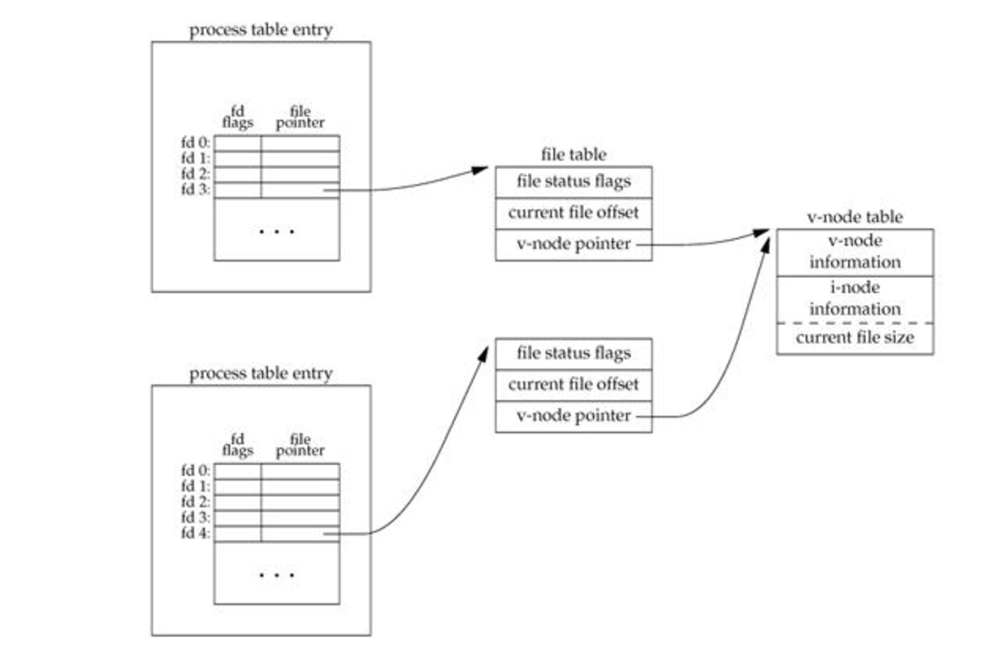

# File Descriptors

**fd** short for file descriptor which is used as a reference to an open file in a process.

## What Is A Process

When we execute a program the system loads it's instructions into the ram and execute them one after another

A program is what we call in this state a _Process_

> A program lives in Hard Drive; A process exist in ram

All process are seperacted with eachother **OS** manage them and allocates memory zone the each of them.

Each process has it's own stack, heap and file descriptors

## System Representation Of Opened Files

- FD Table:

  - Each Process has it's own file descriptor table (process table entry) containing a series of indexes each one refers to
    an an entry in the _open file table_

- Open File Table:

  - Open File Table is shared between all processes, each entry contains among other things:

    - A File Status Flag
    - Current File Offset
    - Number Of References In All Processes
    - A V-node Table Pointer

- V-Node Table

  - V-node information
  - I-node
  - Current File Size

### What is an I-Node Table

The inode (index node) is a data structure in _Unix Systems_, shared between all processes
that describes a file-system object such as a file or a directory.

A directory is a list of inodes with their assigned names.

Each entry in the inode table describes the file in detail:

- The path to its location on the disk,
- Its size
- Its permissions, etc.
- Device of inode
- Inode number
- Mode bits
- Number of links to file
- Owners user id
- Owners group id
- File size in characters
- Time last accessed
- Time last modified
- Time originally created
- And more

### What is an V-Node Table

A v-node serves a similar purpose but it's used in the context of
virtual file-systems.

(An answer from stack overflow) said:
A vnode is an in-memory structure that abstracts much of what
an inode is (an inode can be one of its data fields) but also captures things like operations on `files`, `locks`, `etc`.

This lets it support non-inode based filesystems, in particular networked filesystems.

This is a representation of How it looks like:

